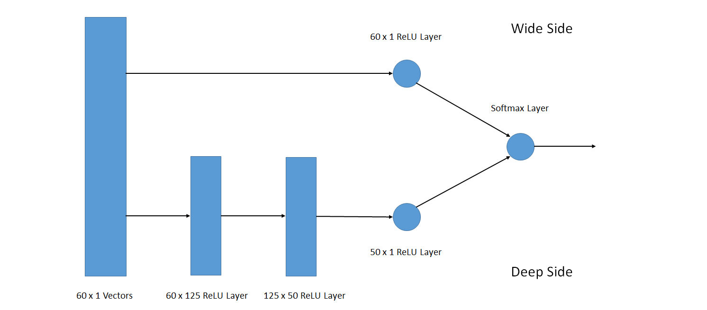

# Financial data Trend Prediction Using Wide and Deep Machine Learning Model
## Overview
This project applies the idea of the wide and deep model proposed by Google to predict the increasing or decreasing trend of financial data. Partial data of NASDAQ 100 stock dataset was used (pasrsed as the text file aal.txt). 
## Network Architecture

## Usage
Make sure that `aal.txt` is in the same directory as `wide_and_deep_financial.py`. 

Run the following command to execute the program

`$ python wide_and_deep_financial.py`

A jupyter notebook with result is also attached in the repository. If the notebook is not run on google colab, please comment the following three lines in the notebook: 
```
from google.colab import files
if not tf.gfile.Exists(FILE_NAME):
  uploaded = files.upload()
```
